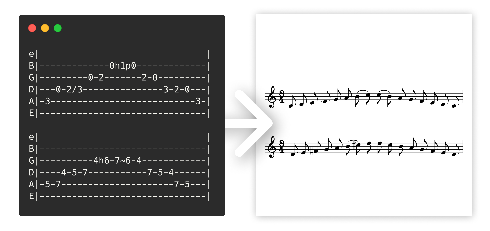
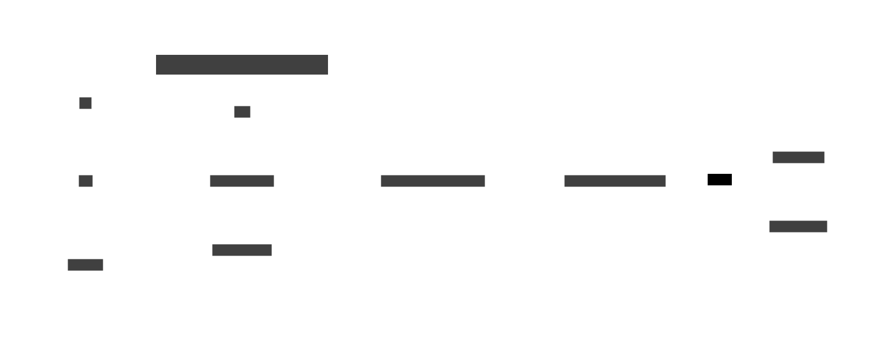

# scoreman

scoreman (Score Manager) is a collection of tools to manage guitar scores.

## Features

The primary use of `scoreman` is to convert guitar tabulature notation (in a `.tab` file per convention) to various
other, machine- or human-readable, formats.

- can translate a tab to a midi file, suitable for playing tabs in real time (**midi** backend)
- can translate a tab file to classical music notation in the .musicxml format (**muxml** backend)
- can try to automatically fix parse errors in a given input file (**fixup** backend)

- user friendly error reports and diagnostics
- generates simple and beautiful scores, close to what you could achieve manually
- well documented CLI
- generally well optimized for performance
- can be used as a library in your own programs

## Demo

## Installation

### Using Nix

You can try scoreman out with [Nix](https://nixos.org) using `nix run github:gilice/scoreman`, or build it with
`nix build github:gilice/scoreman`.

### Using Cargo

This is a bog-standard rust project, so it can be built with `cargo build --release` (or
`cargo build --profile releaseFat` for fat LTO), and installed with `cargo install`.

There is also a `justfile` to make some common tasks easier.

## Usage as a library

Scoreman is much like a compiler. Data flows from a common parser to several Backends.
You can mix and match which components you want to use, if any.

Here's a basic graph of the control flow:

### Understanding the parser

The scoreman parser is a bit special, because the grammar of tab files is context sensitive.
To help with usage, here is a fast explainer:

* A token (tick) does not exactly correspond to one character in the tab: it can be multi-character, for example a
  long fret like `21` or there can be modifiers applied to it, like `21b23r21h22~~~`, which might get removed by the
  backends at some sort of processing.

* The most important idea is that *the validity of an element on the current string* therefore *depends on* the
  *elements
  on other strings* (an example of this is the `MultiBothSlotsFilled` error shown in the demo above).

* The parser is built around this fact. It scans the input *vertically* instead of horizontally, like traditional
  parsers
  do. It accomplishes this by first finding a valid 6-line stretch of notes (called a `Part`) and then consuming that
  left-to right,
  merging multichar elements into one logical tick, as needed.

* For maximum speed, the parser does not use nested data structures. Instead, it produces a *tick stream* which is a
  `Vec<TabElement>`. Every 6-pack of `TabElements` corresponds to one logical tick.
  Information about measures and parts is also stored out of band.
  With this architecture, we can achieve relatively fast speeds (about 350MiB/s just for parsing) via simple code.

* Another unconventional trick used is that the parser doesn't store the source locations corresponding to the tab
  elements.
  This is because we require a `Part` to be a contiguous stretch of 6 lines, and only store the offset of the first line
  for each `Part`.
  Given that, we can cheaply reconstruct the corresponding source offset for a given tick in the error path.
